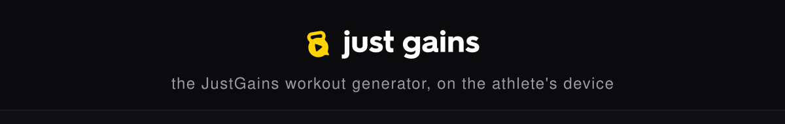

<p align="center">
  
</p>

<p align="center">
  
</p>

# Forge

Forge is the offline workout generator inside
[JustGains](https://justgains.com). The app has three ways to build
training. Creator-made programs come first, LLMs handle fully custom
workout plans, and Forge is there for the moments that need a workout
instantly, on the device, with no connection at all.

Forge began as a faithful recreation of the local AI model that powers
workouts in the Fitbod app. Then we fixed everything we could measure.

Three things make it worth a look:

- **It runs entirely on the device.** No server, no LLM, no network. A full
  session generates in about 150 milliseconds, and the same inputs always
  produce the same workout.
- **It explains itself.** Every exercise carries its score breakdown, where
  its load came from, and a trace of every rule that touched it.
- **It is honest.** When something can't fit (the time window, a circuit, a
  safe load), the plan says so instead of quietly pretending.

## Try it

**Live demo: [justgains.com/quick](https://justgains.com/quick)** — this
exact engine running in your browser, no account needed.

To run it locally you need [bun](https://bun.sh). Then:

```bash
bun install
bun run example     # generate a workout from the bundled catalog and print it
bun test            # the engine's 347-test suite
bun run workshop    # batch-generate hundreds of workouts and validate them
```

The output looks like this:

```
  Full Body, By the Numbers
  requested 45 min · projected ~42 min

  strength  Barbell Bench Press
            warm-up 8 reps @ 27 kg
            warm-up 6 reps @ 34 kg
            warm-up 4 reps @ 41 kg
            2 reps @ 50 kg
            2 reps @ 50 kg
  strength  Barbell Squat
            ...
```

## What this is

Fitbod ships a complete workout generator inside its app. It runs locally, as
a fallback for when the servers can't be reached. We recovered that algorithm
and recreated it faithfully: the exercise-count model, the six-utility ranking,
the muscle recovery decay, the load formulas, and all 21 goal-specific
periodization tables.

That recreation is still in this repo, and its behavior is unchanged. Run
`generateOptimDemo` with no flags and you get Fitbod's recovered logic
exactly. That's the baseline every improvement gets measured against.

The improvements are stacked on top. Each one solves a specific problem we
could measure, and each was tested with the bundled workshop harness across
roughly 13,000 generated workouts:

| Improvement | Before | After |
|---|---|---|
| Circuit requests that produce actual circuits | 32% | 89% |
| Superset requests that produce actual supersets | 47% | 88% |
| Loads converging on the athlete's real strength | never (stuck ~60% light) | ~10 sessions |
| 45 to 90 minute windows actually filled (full gym) | 76 to 81% | 91 to 100% |
| Cold-start loads | invented 20 kg default | honest open loads, never invented |
| Compromises reported to the athlete | one static estimate | a typed notice for each one |

The full stories live in the docs:
[how the algorithm works](docs/how-it-works.md) and
[what we improved, and how we know](docs/improvements.md).

## Use it in your own app

Bring an exercise catalog as JSON (`ExerciseListItem[]`). A balanced
150-exercise sample is bundled. Then:

```ts
import { generateForgeWorkout, defaultOptimDemoInputs } from '@justgains/forge'

const { result, notices } = generateForgeWorkout(
  { ...defaultOptimDemoInputs({ equipmentCodes }), durationMinutes: 45, seed: 42 },
  { exercises, completedWorkouts, muscleUsageStats, bodyWeightKg: 82 },
  'straight',
)
```

Two entry points cover everything:

- `generateForgeWorkout` is the product path. All improvements on, honest
  notices back.
- `generateOptimDemo` is the research path. Recovered Fitbod behavior, with
  every improvement off unless you flag it on individually.

The adapter, `buildWorkoutDataFromOptim`, turns a result into editable
workout rows for a UI. Prescriptions land in placeholders, and nothing is
marked as already lifted.

## The workshop

The workshop is what kept us honest. It sweeps every combination of goal,
experience, split, duration, gear, and grouping. It simulates athletes
through multi-week blocks of training, completing each generated session and
feeding it back into history. And it holds every workout to some tough
invariants: splits stay pure, equipment stays feasible, reps and rests stay
realistic, groups stay intact, any time compromise gets reported, and
identical inputs always generate the identical plan.

```bash
bun run workshop --count 200 --label my-change
bun run workshop --compare .runs/<a>.json .runs/<b>.json
bun run workshop --catalog path/to/your-catalog.json
```

Runs land in `.runs/` as JSON plus a readable report, and any two runs diff.

## Repo map

```
src/index.ts            public surface
src/shared/optim/       the engine: recovered core, improvement policies, 347 tests
src/shared/…            vendored support types and utilities
workshop/               batch validation harness
examples/               runnable quickstart + 150-exercise sample catalog
docs/                   how-it-works, improvements
scripts/                sample-catalog builder, banner builder, monorepo sync
```

The engine is developed inside the JustGains monorepo. This repo is the
standalone export, re-synced with `scripts/sync-from-monorepo.ts`.

## License and provenance

**GPLv3.** Use it, study it, modify it, ship it, commercially or not, as long
as derivative work stays under the same license. See [LICENSE](LICENSE).

A note on provenance: parts of this engine reproduce the observed behavior of
Fitbod's on-device generator, recovered for research and interoperability.
The recovered constants and tables are treated as facts about how that
program behaves. This project is **not affiliated with or endorsed by
Fitbod, Inc.**, and "Fitbod" is a trademark of its owner.
